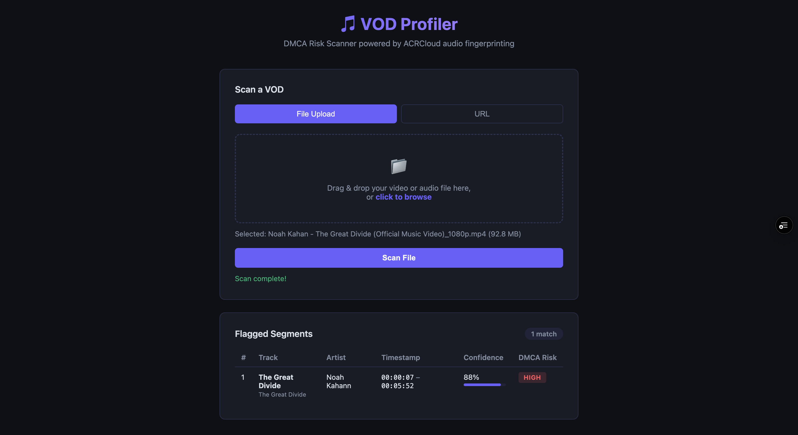

# VOD Profiler

A full-stack DMCA risk scanner for streamers. Submit a video file or URL and
the app fingerprints the audio via ACRCloud, returning a breakdown of
identified copyrighted tracks with timestamps, confidence scores, and DMCA
risk flags.

Live: [vod-profiler.vercel.app](https://vod-profiler.vercel.app)

## Architecture

```
User submits video file or URL
              |
              v
Chunked Upload (4MB chunks via frontend JS)
              |
              v
Express.js API (Vercel Serverless Functions)
              |
              v
ACRCloud Audio Fingerprinting API
              |
              v
Parsed Results: track title, artist, timestamps, confidence score, DMCA risk flag
```

## Tech Stack

- **Backend:** Node.js, Express.js
- **Deployment:** Vercel (Serverless Functions)
- **Audio Fingerprinting:** ACRCloud REST API (HMAC-SHA1 auth)
- **Frontend:** HTML, Vanilla JavaScript

## What This Project Demonstrates

**Chunked Streaming Architecture:** Vercel serverless functions have a 4.5MB
request payload limit. The frontend splits files into 4MB chunks and POSTs
each independently. The server stores chunks in `/tmp` and reassembles them
once all chunks arrive — enabling files 10x the default payload limit to
process without timeout.

**Third-Party API Integration:** ACRCloud uses HMAC-SHA1 signed requests for
authentication. The signature is computed client-side and Base64-encoded on
each request. The app parses the structured response to extract timestamps,
match confidence scores, and map segments to DMCA risk levels.

**Serverless Deployment:** The entire backend runs as Vercel Serverless
Functions. `vercel.json` configures routing, memory limits, and timeout
settings — no server management required.

## Screenshots

### File Upload and Scan Results


## How to Run Locally

**Prerequisites:** Node.js installed, ACRCloud account for API credentials.

```bash
# Clone and install dependencies
git clone https://github.com/jpgoreczky/VOD-Profiler.git
cd VOD-Profiler
npm install

# Configure environment variables
cp .env.example .env
# Edit .env and add your ACRCloud credentials:
# ACRCLOUD_HOST=identify-eu-west-1.acrcloud.com
# ACRCLOUD_ACCESS_KEY=your_access_key
# ACRCLOUD_ACCESS_SECRET=your_access_secret

# Start the development server
npm run dev
```

Open `http://localhost:3000` in your browser.

## Running Tests

```bash
npm test
```

Tests cover the ACRCloud signature builder and the response parser.

## API Reference

### `POST /api/upload`
Accepts one chunk of a large file upload. Returns intermediate progress or
final results on the last chunk.

### `POST /api/recognize`
Single-shot recognition for small audio clips (4MB or less).

**Result object:**
```json
{
  "trackTitle": "Blinding Lights",
  "artist": "The Weeknd",
  "timestampStart": "00:14:32",
  "timestampEnd": "00:17:45",
  "confidenceScore": 92,
  "dmcaRisk": "HIGH"
}
```

**DMCA Risk Levels:**

| Level | ACRCloud Confidence |
|---|---|
| HIGH | 80% and above |
| MEDIUM | 50 to 79% |
| LOW | Below 50% |

## Project Structure

```
VOD-Profiler/
├── api/
│   ├── index.js          # Local dev Express server
│   ├── upload.js         # Chunked upload + ACRCloud scan endpoint
│   └── recognize.js      # Single-shot recognition endpoint
├── src/services/
│   ├── acrcloud.js       # ACRCloud API client (auth + HTTP)
│   └── parser.js         # ACRCloud response to flagged-segment mapper
├── public/
│   ├── index.html        # Frontend UI
│   └── app.js            # Chunked upload logic + results rendering
├── tests/
│   ├── acrcloud.test.js  # Signature generation unit tests
│   └── parser.test.js    # Response parsing unit tests
├── .env.example          # Environment variable template
├── vercel.json           # Vercel deployment configuration
└── package.json
```